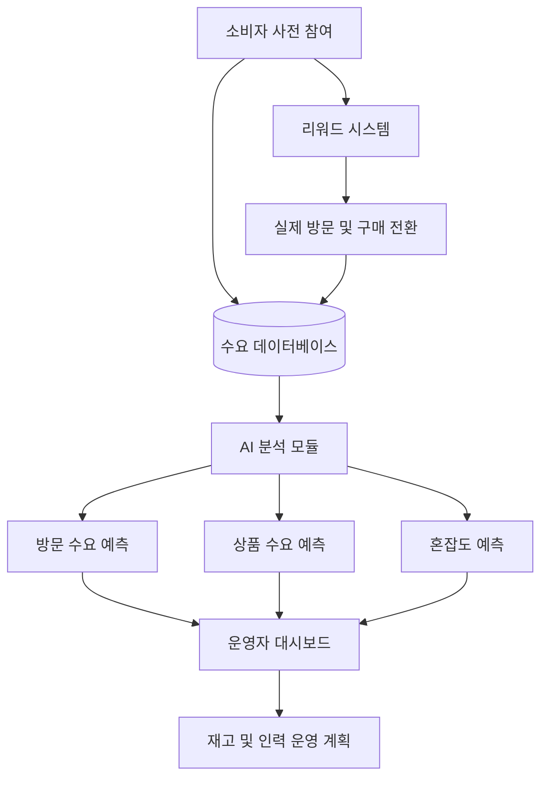

# AD 프로젝트 기획서

## 프로젝트명

**PopCast: AI 기반 지역 팝업스토어 사전 수요 예측 및 리워드 운영 시스템**

## 1. 프로젝트 개요

PopCast는 지역 상권, 소상공인, 로컬 브랜드가 팝업스토어를 열기 전에 소비자의 방문 의향과 상품 선호 데이터를 수집하고, AI 분석을 통해 예상 방문자 수, 인기 상품, 혼잡 시간대, 적정 재고량을 예측하는 시스템이다.

소비자는 사전 설문과 방문 예약에 참여하고 리워드를 받는다. 운영자는 수집된 데이터를 바탕으로 더 합리적인 재고, 인력, 시간대 운영 계획을 세울 수 있다.

## 2. 해결하고자 하는 지역사회 문제

지역 상권과 소규모 브랜드는 팝업스토어를 통해 고객을 만나고 홍보할 수 있지만, 실제 운영에는 큰 불확실성이 존재한다.

- 방문객 수를 예측하기 어렵다.
- 인기 상품과 준비 수량을 정확히 알기 어렵다.
- 특정 시간대에 방문객이 몰려 혼잡이 발생한다.
- 재고 부족 또는 과잉으로 비용 손실이 발생한다.
- 데이터 분석 역량이 부족한 소상공인은 팝업 운영 실패 위험이 크다.

이 문제는 단순히 한 브랜드의 마케팅 문제가 아니라, 지역 상권의 방문 경험과 소상공인의 운영 안정성에 영향을 주는 지역사회 문제로 볼 수 있다.

## 3. 핵심 해결 전략

PopCast의 해결 전략은 세 단계이다.

1. **사전 참여 데이터 수집**
   소비자가 팝업스토어 오픈 전에 방문 의향, 관심 상품, 희망 시간대, 예상 구매 금액을 입력한다.

2. **AI 기반 수요 예측**
   수집된 데이터를 분석하여 예상 방문자 수, 시간대별 혼잡도, 상품별 예상 수요를 계산한다.

3. **리워드 기반 방문 전환**
   설문 참여자에게 포인트, 쿠폰, 우선 입장권을 제공해 단순 관심을 실제 방문과 구매로 연결한다.

## 4. 시스템 사용자

| 사용자 | 역할 |
| --- | --- |
| 소비자 | 사전 설문 참여, 방문 예약, 리워드 사용 |
| 팝업 운영자 | 팝업 등록, 설문 생성, 예측 리포트 확인 |
| 지역 상권 조직 | 지역별 방문 수요와 상권 활성화 데이터 확인 |

## 5. 시스템 구조

## 6. 주요 기능 설계

### 소비자 기능

- 지역 팝업스토어 목록 확인
- 팝업 상세 정보 확인
- 사전 설문 참여
- 관심 상품 선택
- 방문 희망 시간 예약
- 쿠폰, 포인트, 우선 입장권 수령
- QR 코드 기반 방문 인증

### 운영자 기능

- 팝업스토어 정보 등록
- 사전 설문 문항 설정
- 참여자 수와 예약자 수 확인
- 예상 방문자 수 확인
- 인기 상품 순위 확인
- 시간대별 혼잡도 확인
- 추천 재고량 확인
- 리워드 조건 설정

### AI 분석 기능

- 사전 참여 데이터 기반 방문 수요 예측
- 상품 선호도 기반 재고 추천
- 방문 희망 시간 기반 혼잡도 예측
- 쿠폰 반응 기반 방문 전환 가능성 분석
- 실제 방문 데이터를 반영한 예측 개선

## 7. 요소 기술 조사

| 요소 기술 | 사용 목적 | 실현 가능성 |
| --- | --- | --- |
| 웹/앱 서비스 | 소비자 참여와 운영자 관리 | 높음 |
| 클라우드 데이터베이스 | 설문, 예약, 리워드 데이터 저장 | 높음 |
| 머신러닝 | 방문 수요와 상품 수요 예측 | 중간 |
| 데이터 시각화 | 운영자 대시보드 구성 | 높음 |
| QR 인증 | 실제 방문 여부 확인 | 높음 |
| 위치 기반 서비스 | 지역별 팝업 추천 | 높음 |
| 쿠폰/포인트 시스템 | 참여 유도와 방문 전환 | 높음 |

## 8. 기대 효과

- 소상공인과 로컬 브랜드의 팝업 운영 실패 위험을 줄인다.
- 재고 과잉과 상품 품절을 줄여 운영 효율을 높인다.
- 방문객을 시간대별로 분산시켜 혼잡과 대기 시간을 완화한다.
- 소비자는 사전 참여를 통해 혜택을 받고 더 편하게 방문할 수 있다.
- 지역 상권은 데이터 기반으로 방문객 유입을 계획할 수 있다.

## 9. 프로젝트의 차별성

기존 팝업 플랫폼이 홍보와 예약에 집중한다면, PopCast는 팝업스토어 오픈 전의 불확실성을 줄이는 데 집중한다.

핵심 차별점은 다음과 같다.

- 사전 참여 데이터를 운영 의사결정에 직접 활용한다.
- AI 예측 결과가 재고, 인력, 시간대 운영으로 연결된다.
- 리워드 시스템을 통해 데이터 수집과 실제 방문 전환을 동시에 유도한다.
- 지역 상권과 소규모 브랜드도 활용할 수 있는 구조이다.

## 10. 발표 핵심 문장

> PopCast는 팝업스토어를 감으로 준비하지 않고, 사전 참여 데이터와 AI 예측으로 준비하게 만드는 지역 상권 운영 지원 시스템이다.

