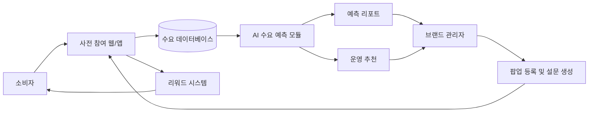

# AI 기반 지역 팝업스토어 사전 수요 예측 및 리워드 운영 시스템

## 1. 프로젝트 한 줄 설명

지역 상권과 소규모 브랜드가 팝업스토어를 열기 전에 방문 수요, 인기 상품, 혼잡 시간대, 적정 재고를 예측할 수 있도록 돕는 AI/SW 개념 설계 프로젝트이다.

## 2. 문제 정의

최근 팝업스토어는 브랜드 홍보, 지역 상권 활성화, 청년 창업 실험의 수단으로 많이 활용되고 있다. 하지만 실제 운영 과정에서는 다음과 같은 문제가 반복된다.

- 방문객 수요를 감으로 예측하여 재고 부족 또는 과잉 준비가 발생한다.
- 특정 시간대에 방문객이 몰려 대기 시간이 길어지고 현장 경험이 나빠진다.
- 어떤 상품이나 굿즈가 인기가 있을지 사전에 파악하기 어렵다.
- 지역 소상공인과 소규모 브랜드는 데이터 분석 역량이 부족해 팝업 운영 실패 위험이 크다.
- 방문 의향은 있었지만 실제 방문과 구매로 이어지지 않는 경우가 많다.

이 프로젝트는 팝업스토어 오픈 전 소비자의 관심 데이터를 수집하고, AI 분석을 통해 운영 의사결정을 지원하는 시스템을 제안한다.

## 3. 핵심 아이디어

소비자는 팝업스토어 오픈 전에 사전 설문, 관심 상품 선택, 방문 희망 시간 등록에 참여한다. 시스템은 참여자에게 포인트, 쿠폰, 우선 입장권 같은 리워드를 제공한다.

수집된 데이터는 AI 분석 모듈을 통해 다음과 같은 예측 결과로 변환된다.

- 예상 방문자 수
- 시간대별 혼잡도
- 인기 상품 및 굿즈 순위
- 예상 구매 전환율
- 추천 재고량
- 운영 인력 배치 제안

즉, 이 시스템의 핵심은 **사전 참여 데이터를 이용해 팝업스토어 운영을 감이 아니라 데이터 기반으로 바꾸는 것**이다.

## 4. 지역사회 문제 해결 관점

이 프로젝트는 단순한 이벤트 플랫폼이 아니라 지역 상권의 팝업 운영 문제를 해결하기 위한 AI/SW 시스템이다.

- 지역 소상공인의 팝업 운영 실패 위험 감소
- 대학가, 전통시장, 로컬 브랜드의 방문객 유입 확대
- 혼잡 완화를 통한 방문객 경험 개선
- 재고 과잉으로 인한 비용과 폐기물 감소
- 청년 창업자와 소규모 브랜드의 오프라인 시장 진입 장벽 완화

## 5. 주요 사용자

| 사용자 | 필요 | 제공 기능 |
| --- | --- | --- |
| 소비자 | 관심 있는 팝업 발견, 혜택 획득, 편한 방문 | 사전 설문, 방문 예약, 리워드, 쿠폰 |
| 지역 소상공인 | 수요 예측, 재고 결정, 홍보 | 예측 대시보드, 설문 생성, 운영 추천 |
| 브랜드 담당자 | 팝업 운영 성과 향상 | 고객 분석, 상품 선호도 분석, 예약 관리 |
| 지역 행정/상권 조직 | 지역 방문 유도, 혼잡 관리 | 지역별 수요 분석, 방문 흐름 리포트 |

## 6. 시스템 개념 구조

## 7. 주요 기능

### 소비자 기능

- 지역별 팝업스토어 탐색
- 사전 수요 조사 참여
- 관심 상품 및 굿즈 선택
- 방문 희망 날짜와 시간대 등록
- 포인트, 쿠폰, 우선 입장권 확인
- 실제 방문 인증 및 추가 리워드 적립

### 운영자 기능

- 팝업스토어 정보 등록
- 사전 설문 문항 생성
- 예약자 및 참여자 현황 확인
- 예상 방문자 수 확인
- 시간대별 혼잡도 확인
- 인기 상품 순위 확인
- 추천 재고량과 운영 인력 제안 확인

### AI 분석 기능

- 사전 참여 데이터를 이용한 방문 수요 예측
- 상품 선호도 기반 인기 굿즈 예측
- 방문 희망 시간 기반 혼잡도 예측
- 참여자 특성 기반 구매 가능성 추정
- 실제 방문 데이터 반영을 통한 예측 정확도 개선

## 8. 기대 효과

- 팝업스토어 운영자는 더 적은 시행착오로 준비할 수 있다.
- 소비자는 혜택을 받고 더 편리하게 방문할 수 있다.
- 지역 상권은 예측 가능한 방문객 유입을 만들 수 있다.
- AI/SW가 실제 지역사회 문제인 상권 활성화와 운영 비효율 개선에 활용된다.

## 9. 문서 구성

- [문제 정의](docs/problem-definition.md)
- [시스템 설계](docs/system-design.md)
- [AI 및 데이터 설계](docs/ai-data-design.md)
- [발표 구성안](docs/presentation-outline.md)

