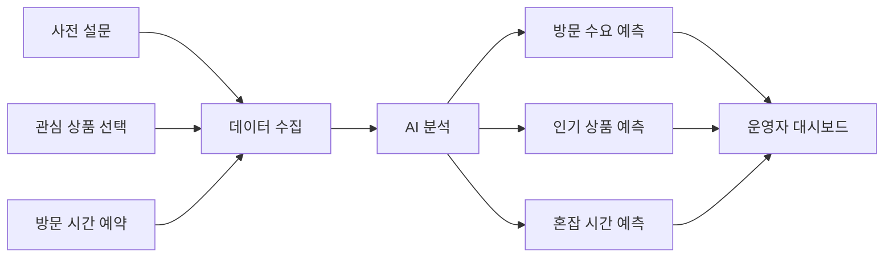

# 발표 구성안

## 발표 목표

7분 이내 발표에서 청중이 반드시 기억해야 할 핵심은 다음 한 문장이다.

> 팝업스토어를 감으로 준비하지 않고, 사전 참여 데이터와 AI 예측으로 준비하게 만드는 시스템

## 1. 도입: 공감 가능한 문제 제시

팝업스토어는 인기 있어 보이지만 운영자 입장에서는 불확실성이 크다. 사람이 얼마나 올지, 어떤 상품이 팔릴지, 언제 몰릴지 정확히 알기 어렵다.

발표 시작 예시:

> 팝업스토어에 갔는데 대기 줄이 너무 길어서 포기한 경험이 있나요? 반대로 운영자 입장에서는 사람이 안 올까 봐 재고와 인력을 얼마나 준비해야 할지 고민합니다.

## 2. 문제 정의

핵심 문제:

- 수요 예측 실패
- 재고 부족 또는 과잉
- 긴 대기와 혼잡
- 소규모 브랜드의 데이터 부족
- 지역 상권 팝업 운영 실패 위험

## 3. 제안 시스템

시스템 이름 후보:

- PopCast
- PopupPulse
- ReadyPop
- LocalPop AI

추천 이름:

> **PopCast: AI 기반 지역 팝업 수요 예측 시스템**

PopCast는 팝업스토어 오픈 전에 소비자 참여 데이터를 수집하고, AI로 분석해 운영 전략을 제안하는 플랫폼이다.

## 4. 동작 방식

## 5. 핵심 기능

- 소비자 사전 참여
- 리워드 지급
- 방문 예약
- AI 수요 예측
- 상품별 추천 재고량
- 시간대별 혼잡도 예측
- 운영자 대시보드

## 6. 요소 기술 조사

발표에서는 너무 깊게 설명하지 말고, “현재 기술로 구현 가능하다”는 점을 보여주는 정도가 좋다.

| 기술 | 사용 이유 |
| --- | --- |
| 웹/앱 서비스 | 소비자 참여와 운영자 관리 |
| 데이터베이스 | 설문, 예약, 리워드 기록 저장 |
| 머신러닝 | 방문자 수와 상품 수요 예측 |
| 데이터 시각화 | 대시보드 차트 제공 |
| QR 체크인 | 실제 방문 여부 확인 |
| 위치 기반 서비스 | 지역 팝업 추천 |

## 7. 기대 효과

- 운영자는 재고와 인력을 효율적으로 준비할 수 있다.
- 소비자는 리워드를 받고 편리하게 방문할 수 있다.
- 지역 상권은 예측 가능한 방문객 유입을 만들 수 있다.
- AI/SW가 지역경제 활성화와 운영 비효율 개선에 기여한다.

## 8. 발표 시간 배분

| 구간 | 시간 | 내용 |
| --- | --- | --- |
| 도입 | 1분 | 팝업스토어 경험과 문제 제시 |
| 문제 정의 | 1분 | 운영자와 소비자의 불편 |
| 해결 아이디어 | 1분 30초 | 사전 참여 + AI 예측 + 리워드 |
| 시스템 구조 | 1분 30초 | 데이터 흐름과 주요 모듈 |
| 요소 기술 | 1분 | 구현 가능성 설명 |
| 기대 효과 | 1분 | 지역사회 문제 해결 연결 |

## 9. 발표 슬라이드 구성

1. 제목: PopCast
2. 문제 상황: 팝업스토어 운영의 불확실성
3. 해결 아이디어: 사전 참여 데이터 기반 예측
4. 시스템 구조도
5. AI 분석 항목
6. 리워드와 방문 전환 구조
7. 지역사회 기대 효과
8. 결론: 감이 아닌 데이터로 운영하는 지역 팝업

