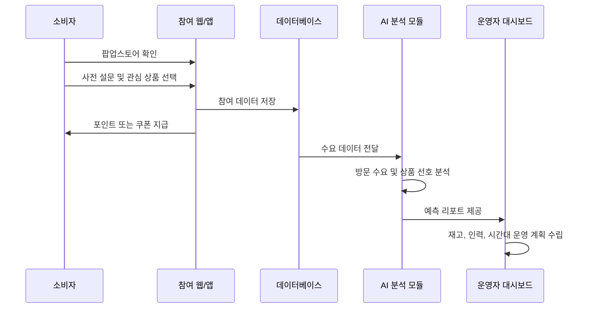
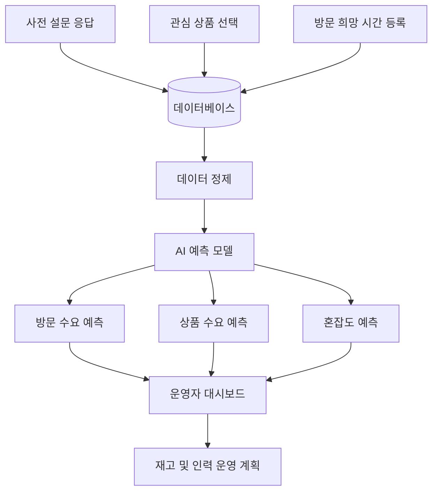

# 시스템 설계

## 1. 전체 개념

본 시스템은 팝업스토어 오픈 전 소비자 참여 데이터를 수집하고, 이를 AI가 분석하여 운영자에게 수요 예측과 운영 전략을 제공하는 플랫폼이다.

시스템은 크게 네 영역으로 구성된다.

- 소비자 참여 시스템
- 운영자 관리 시스템
- AI 수요 예측 시스템
- 리워드 및 방문 전환 시스템

## 2. 사용자 흐름

## 3. 주요 모듈

### 3.1 소비자 참여 모듈

소비자가 팝업스토어 정보를 확인하고 사전 참여를 수행하는 영역이다.

주요 입력 데이터:

- 방문 의향
- 방문 희망 날짜
- 방문 희망 시간대
- 관심 상품
- 예상 구매 금액
- 동반 인원
- 거주 지역 또는 주요 활동 지역

### 3.2 운영자 관리 모듈

브랜드 또는 지역 상권 담당자가 팝업스토어를 등록하고 데이터를 확인하는 영역이다.

주요 기능:

- 팝업스토어 등록
- 사전 설문 생성
- 참여자 수 확인
- 예약 현황 확인
- 예측 대시보드 확인
- 리워드 조건 설정

### 3.3 AI 분석 모듈

수집된 데이터를 분석하여 운영에 필요한 예측 정보를 만든다.

분석 결과:

- 예상 방문자 수
- 시간대별 혼잡도
- 상품별 예상 수요
- 예상 매출 범위
- 추천 재고량
- 운영 인력 배치 제안

### 3.4 리워드 모듈

소비자의 사전 참여를 유도하고 실제 방문으로 연결하는 장치이다.

리워드 예시:

- 설문 참여 포인트
- 관심 상품 할인 쿠폰
- 우선 입장권
- 방문 인증 추가 적립
- 구매 금액 조건 달성 시 굿즈 교환권

## 4. 데이터 흐름

## 5. 구현 가능성

이 시스템은 현재 기술로 구현 가능한 요소들로 구성된다.

| 요소 기술 | 활용 방식 | 구현 가능성 |
| --- | --- | --- |
| 웹/앱 서비스 | 소비자 참여 및 운영자 대시보드 | 높음 |
| 데이터베이스 | 설문, 예약, 리워드 기록 저장 | 높음 |
| 위치 기반 서비스 | 지역별 팝업 추천 | 높음 |
| 데이터 시각화 | 예측 결과 차트 표시 | 높음 |
| 머신러닝 | 방문 수요 및 상품 수요 예측 | 중간 |
| QR 인증 | 실제 방문 확인 | 높음 |
| 쿠폰/포인트 시스템 | 리워드 지급 및 사용 | 높음 |

## 6. 예상 화면

### 소비자 화면

- 오늘의 지역 팝업 목록
- 팝업 상세 정보
- 사전 참여 설문
- 관심 상품 선택
- 리워드 지갑
- 방문 QR 코드

### 운영자 화면

- 팝업 등록
- 설문 설정
- 참여자 통계
- 수요 예측 대시보드
- 시간대별 혼잡도 그래프
- 상품별 추천 재고량

